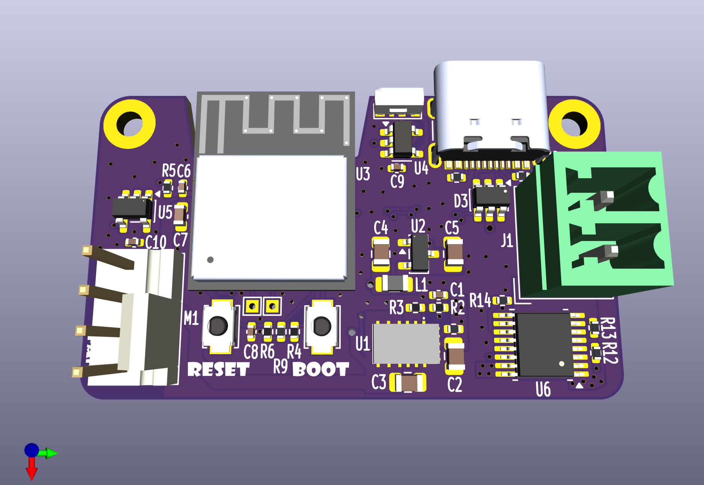
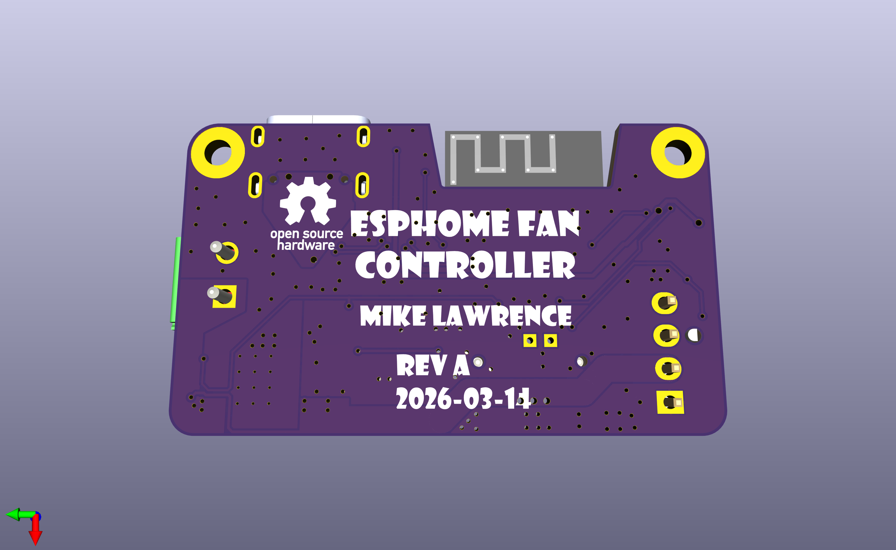
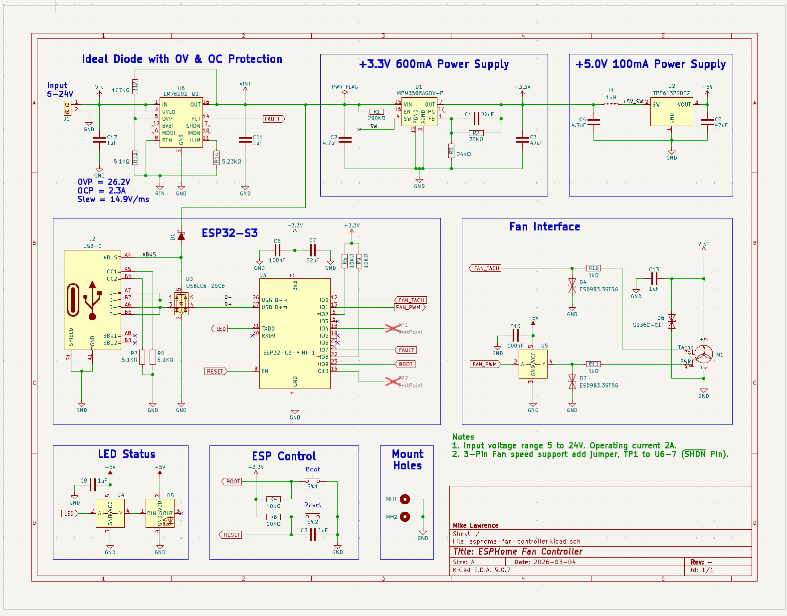
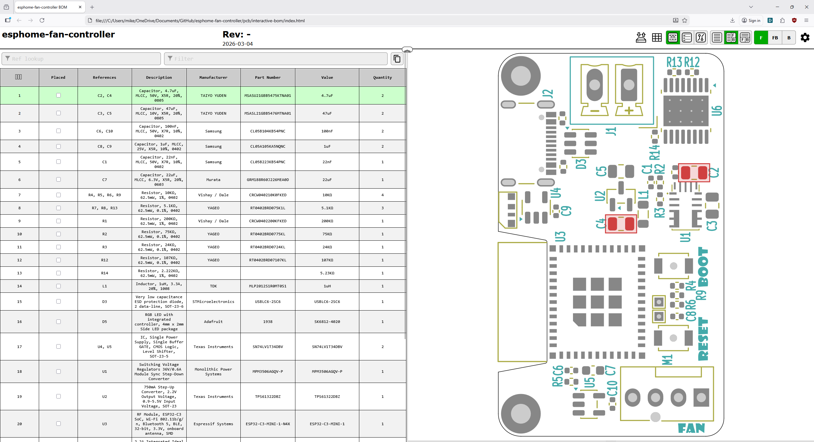

# ESPHome RGBCCT LED Controller

  
  

This is a simple ESP32-C3 based fan controller design to support 4-pin computer fans from 5V to 24V at up to 2 amps. Fan tachometer is supported.

## Web Installation

Goto [Github Pages](https://mikelawrence.github.io/esphome-fan-controller/) if you want to install a prebuilt image and receive automatic update notifications via Home Assistant.

## Status

* **Rev -:** Ordered boards from JLCPCB. Ordered parts from Mouser and Digikey. Board is assembled but there is a problem with the 5V Power Supply. Wait for Rev A.
* **Rev A:** Coming soon!

## Schematic

      
    Schematic

## Bill of Materials

      
    Interactive BOM

